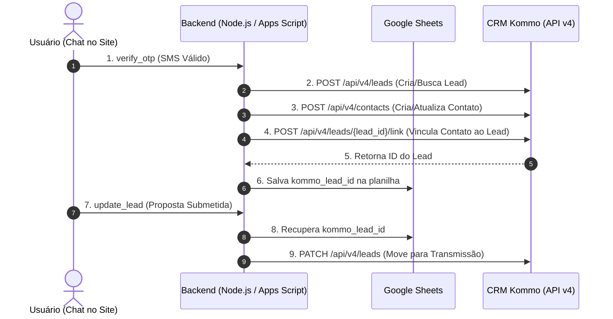

# Integração Direta Google Apps Script ➔ Kommo CRM (API v4)

Documentação da arquitetura **direta** entre o backend Google Apps Script ([backend-apps-script.gs](file:///c:/Users/Liga%20Vit%C3%B3ria%20MKT/Desktop/Simulador%20Cons%C3%B3rcio/simulador-consorcio/backend-apps-script.gs)) e a API v4 do **Kommo CRM**, eliminando completamente o n8n.

---

## 🎯 Arquitetura da Integração



---

## 🔗 Vinculação de Contatos e Leads (Kommo API v4)

Na API v4 do Kommo, requisições individuais `POST /api/v4/leads` e `POST /api/v4/contacts` não processam a propriedade `_embedded` para relacionar entidades. 

Para garantir o vínculo perfeito:
1. O Lead e o Contato são criados individualmente (ou o contato existente é localizado).
2. Uma requisição explícita é enviada para `POST /api/v4/leads/{lead_id}/link` com o payload:
```json
[
  {
    "to_entity_id": contact_id,
    "to_entity_type": "contacts",
    "metadata": { "is_main": true }
  }
]
```

---

## 🏷️ Tags atribuídas no Kommo CRM

Atribuídas automaticamente na criação do lead ou quando um lead existente está nas fases iniciais permitidas (`109093603` ou `109093599`):
- **`Simulador Consórcio`**
- **`Mensagem Simulador`** *(Aplicada apenas em novos leads ou se o lead existente estiver nas fases permitidas `109093603`/`109093599`. Se o lead estiver em fase avançada, esta tag é omitida)*

---

## 🛡️ Regra de Preservação de Fase para Leads Existentes

Ao simular ou verificar OTP com um número que já possui Lead cadastrado no Kommo CRM:
1. O backend consulta o estado atual do lead no Kommo (`GET /api/v4/leads/{id}`).
2. Se o lead estiver atualmente nas fases **`109093603`** ou **`109093599`**, o lead é movido para **Sem Contato** (`109917515`).
3. Se o lead estiver em qualquer outra fase (ex: Transmissão `109093615` ou fases avançadas de atendimento), a **fase original é mantida** (não retrocede no funil) e a tag **`Mensagem Simulador`** não é reaplicada.


## 🔑 Configuração das Propriedades do Script (Google Apps Script)

Para ativar a integração direta, acesse no editor do Google Apps Script:
**⚙ Configurações do projeto** ➔ **Propriedades do script** ➔ Adicionar propriedade:

* **`KOMMO_TOKEN`**: Token de Acesso de Longa Duração (Bearer Token do Kommo).
* **`KOMMO_SUBDOMAIN`**: `gustavoligavitoriacom` (opcional, padrão).
* **`KOMMO_STAGE_TRANSMISSAO`**: `109093615` (opcional, padrão).
* **`KOMMO_PIPELINE_ID`**: `14131759` (opcional, padrão).

---

## 🚀 Como Atualizar o Backend no Google Apps Script

No editor do Apps Script ([Leads do Consórcio - Landbot](https://docs.google.com/spreadsheets/d/1FeMY6hfwSix7YR_ndVVxFjcqt2D4JaPWtd38Qc4wP3k/edit)):

1. Copie todo o código do arquivo [backend-apps-script.gs](file:///c:/Users/Liga%20Vit%C3%B3ria%20MKT/Desktop/Simulador%20Cons%C3%B3rcio/simulador-consorcio/backend-apps-script.gs).
2. Cole no arquivo de código do Apps Script (Extensões ➔ Apps Script).
3. Clique em **Implantar** ➔ **Gerenciar implantações** ➔ Clique no ícone de lápis (Editar) ➔ Selecione **"Nova versão"** ➔ Clique em **Implantar**.
