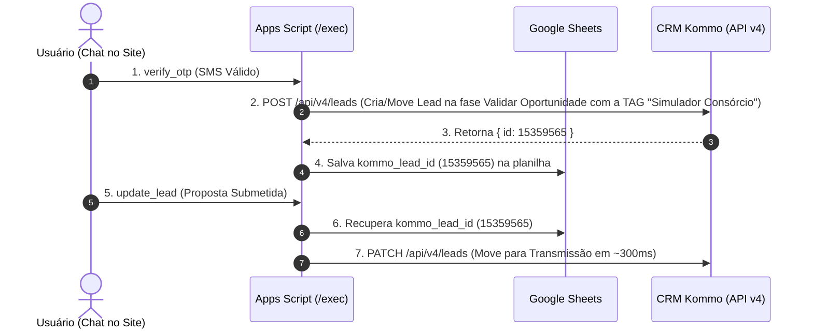

# Integração Direta Google Apps Script ➔ Kommo CRM (API v4)

Documentação da arquitetura **direta** entre o backend Google Apps Script ([backend-apps-script.gs](file:///c:/Users/Liga%20Vit%C3%B3ria%20MKT/Desktop/Simulador%20Cons%C3%B3rcio/simulador-consorcio/backend-apps-script.gs)) e a API v4 do **Kommo CRM**, eliminando completamente o n8n.

---

## 🎯 Arquitetura da Integração

---

## 🏷️ Tags atribuídas no Kommo CRM

- **`Simulador Consórcio`**: Atribuída automaticamente na primeira criação ou atualização do lead ao entrar na etapa de **Validar Oportunidade** (estágio inicial `109093611`).

---

## 🔑 Configuração das Propriedades do Script (Google Apps Script)

Para ativar a integração direta, acesse no editor do Google Apps Script:
**⚙ Configurações do projeto** ➔ **Propriedades do script** ➔ Adicionar propriedade:

* **`KOMMO_TOKEN`**: Token de Acesso de Longa Duração (Bearer Token do Kommo).
* **`KOMMO_SUBDOMAIN`**: `gustavoligavitoriacom` (opcional, padrão).
* **`KOMMO_STAGE_TRANSMISSAO`**: `109093615` (opcional, padrão).
* **`KOMMO_PIPELINE_ID`**: `14131759` (opcional, padrão).

---

## 🚀 Como Atualizar o Backend no Google Apps Script

No editor do Apps Script ([Leads do Consórcio - Landbot](https://docs.google.com/spreadsheets/d/1FeMY6hfwSix7YR_ndVVxFjcqt2D4JaPWtd38Qc4wP3k/edit)):

1. Copie todo o código do arquivo [backend-apps-script.gs](file:///c:/Users/Liga%20Vit%C3%B3ria%20MKT/Desktop/Simulador%20Cons%C3%B3rcio/simulador-consorcio/backend-apps-script.gs).
2. Cole no arquivo de código do Apps Script (Extensões ➔ Apps Script).
3. Clique em **Implantar** ➔ **Gerenciar implantações** ➔ Clique no ícone de lápis (Editar) ➔ Selecione **"Nova versão"** ➔ Clique em **Implantar**.
