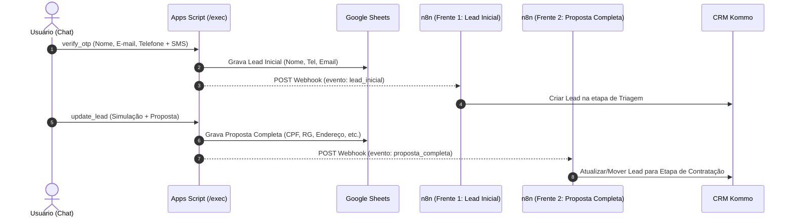

# Integração Webhooks n8n / Kommo CRM

Documentação técnica do envio automático de webhooks a partir do backend Google Apps Script ([backend-apps-script.gs](file:///c:/Users/Liga%20Vit%C3%B3ria%20MKT/Desktop/Simulador%20Cons%C3%B3rcio/simulador-consorcio/backend-apps-script.gs)) para o **n8n / Kommo CRM**.

---

## 🎯 Arquitetura da Integração

A integração envia dados em **duas frentes separadas** para permitir fluxos de automação e regras comerciais distintas no Kommo CRM:



---

## 🟢 Frente 1: Lead Inicial (Verificação SMS)

- **Gatilho**: Disparado na função `verifyOtp`, logo que o usuário valida o código de SMS.
- **URL Padrão**: `https://ligavitoria-undsmj.app.n8n.cloud/webhook/simulador-lead-inicial`
- **Variável de Sobrescrita** (Propriedades do Script): `N8N_WEBHOOK_LEAD_INICIAL`
- **Payload Enviado**:
```json
{
  "evento": "lead_inicial",
  "timestamp": "2026-07-31T14:00:00.000Z",
  "uuid": "8f3a1b2c-4d5e-6f7a-8b9c-0d1e2f3a4b5c",
  "lead": {
    "nome": "Carlos Andrade",
    "email": "carlos.andrade@email.com",
    "telefone": "27999887766",
    "tipo": "Imóvel",
    "dispositivo": "Mobile",
    "url": "https://livelo.ligavitoria.com.br/simulador-consorcio/"
  }
}
```

---

## 🔵 Frente 2: Proposta Completa (Cadastro Finalizado)

- **Gatilho**: Disparado na função `updateLead`, quando o formulário final de proposta é submetido.
- **URL Padrão**: `https://ligavitoria-undsmj.app.n8n.cloud/webhook/simulador-proposta-completa`
- **Variável de Sobrescrita** (Propriedades do Script): `N8N_WEBHOOK_PROPOSTA`
- **Payload Enviado**:
```json
{
  "evento": "proposta_completa",
  "timestamp": "2026-07-31T14:02:00.000Z",
  "uuid": "8f3a1b2c-4d5e-6f7a-8b9c-0d1e2f3a4b5c",
  "lead": {
    "nome": "Carlos Eduardo Andrade",
    "email": "carlos.andrade@email.com",
    "telefone": "27999887766",
    "tipo": "Imóvel",
    "valor": 250000,
    "plano": "O12 IMOVEL PLANO FLEX MEDIO XO12X",
    "credito": 250000,
    "parcela": "R$ 1.153,00",
    "descricao": "IMOVEL FLEX",
    "pontos": 54941,
    "proposta": {
      "nome_completo": "Carlos Eduardo Andrade",
      "cpf": "123.456.789-00",
      "nascimento": "20/04/1988",
      "rg": "1.234.567-ES",
      "orgao": "SSP-ES",
      "naturalidade": "Vitória - ES",
      "nome_mae": "Maria das Graças Andrade",
      "endereco": "Av. Beira Mar, 500, Apt 302, Vitória - ES",
      "cep": "29010-000"
    }
  }
}
```

---

## 🛡️ Resiliência & Tratamento de Erros

- O despacho do webhook é envelopado pela função `despacharWebhookN8N(url, payload)` usando bloco `try/catch` com `muteHttpExceptions: true`.
- Em caso de indisponibilidade ou falha do servidor do n8n/Kommo, o erro é gravado silenciosamente no `Logger.log` do Apps Script.
- **A gravação na planilha do Google Sheets e a experiência do cliente no chat nunca são afetadas.**

---

## 🚀 Como Atualizar no Ambiente de Produção (Google Apps Script)

Para sincronizar este código no Google Apps Script via `clasp`:

```bash
cp backend-apps-script.gs scratch/gas/Código.js
cd scratch/gas
clasp push
clasp update-deployment <ID_DA_IMPLANTAÇÃO>
```

> ⚠️ Lembre-se de sempre usar `update-deployment` para preservar a URL `/exec` do backend.
