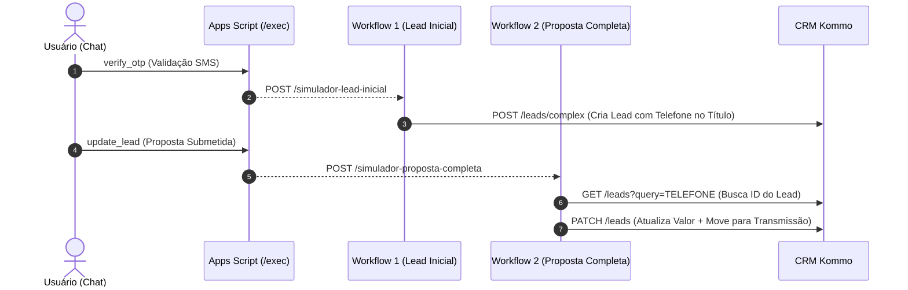

# Integração Webhooks n8n / Kommo CRM — Guia Completo e Definitivo

Documentação técnica do envio automático de webhooks a partir do backend Google Apps Script ([backend-apps-script.gs](file:///c:/Users/Liga%20Vit%C3%B3ria%20MKT/Desktop/Simulador%20Cons%C3%B3rcio/simulador-consorcio/backend-apps-script.gs)) para o **n8n / Kommo CRM**.

---

## 🎯 Arquitetura da Integração



---

## 🟢 WORKFLOW 1: LEAD INICIAL (`simulador-lead-inicial`)

### Nó 1: Webhook
- **Method**: `POST`
- **Path**: `simulador-lead-inicial`
- **Authentication**: `None`

### Nó 2: HTTP Request (Criar Lead Triagem)
- **Method**: `POST`
- **URL**: `https://gustavoligavitoriacom.kommo.com/api/v4/leads/complex`
- **Authentication**: `Generic Credential Type` ➔ `Bearer Auth`
- **JSON**:
```json
[
  {
    "name": "Consórcio {{ $json.body.lead.tipo }} - {{ $json.body.lead.nome }} ({{ $json.body.lead.telefone }})",
    "_embedded": {
      "contacts": [
        {
          "first_name": "{{ $json.body.lead.nome }}",
          "custom_fields_values": [
            {
              "field_code": "PHONE",
              "values": [ { "value": "{{ $json.body.lead.telefone }}" } ]
            },
            {
              "field_code": "EMAIL",
              "values": [ { "value": "{{ $json.body.lead.email }}" } ]
            }
          ]
        }
      ]
    }
  }
]
```

---

## 🔵 WORKFLOW 2: PROPOSTA COMPLETA (`simulador-proposta-completa`)

### Nó 1: Webhook (Nome do Nó: `Webhook Proposta Completa`)
- **Method**: `POST`
- **Path**: `simulador-proposta-completa`
- **Authentication**: `None`

### Nó 2: HTTP Request (Nome do Nó: `Buscar Lead`)
- **Method**: `GET`
- **URL**: `https://gustavoligavitoriacom.kommo.com/api/v4/leads?query={{ $json.body.lead.telefone }}`
- **Authentication**: `Generic Credential Type` ➔ `Bearer Auth`

### Nó 3: HTTP Request (Nome do Nó: `Patch Lead`)
- **Method**: `PATCH`
- **URL**: `https://gustavoligavitoriacom.kommo.com/api/v4/leads`
- **Authentication**: `Generic Credential Type` ➔ `Bearer Auth`
- **JSON**:
```json
[
  {
    "id": {{ $json._embedded.leads[$json._embedded.leads.length - 1].id }},
    "name": "🔥 PROPOSTA {{ $('Webhook Proposta Completa').json.body.lead.tipo }} - {{ $('Webhook Proposta Completa').json.body.lead.proposta.nome_completo }}",
    "price": {{ $('Webhook Proposta Completa').json.body.lead.valor }},
    "pipeline_id": {{ $json._embedded.leads[$json._embedded.leads.length - 1].pipeline_id }},
    "status_id": 109093615
  }
]
```
